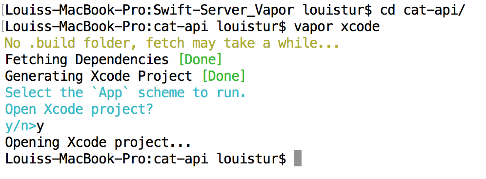
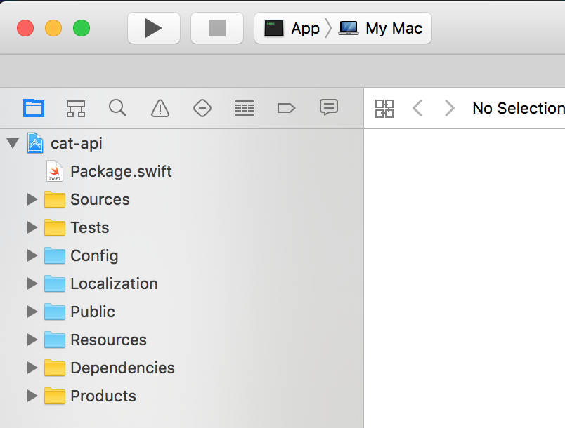

# Server Side Swift w/ Vapor
An intro to Server Side Swift using Vapor
---

### Pre-Requisites
1. [Installing Vapor](https://vapor.github.io/documentation/getting-started/install-toolbox.html)
2. [Installing Heroku CLI](https://devcenter.heroku.com/articles/heroku-cli)

### Readings
1. [Hello, World! Vapor Tut](https://vapor.github.io/documentation/getting-started/hello-world.html)
3. [Vapor Folder Structure](https://vapor.github.io/documentation/guide/folder-structure.html)
4. [Basic Routing](https://vapor.github.io/documentation/routing/basic.html)
5. [Request Object](https://vapor.github.io/documentation/http/request.html)

### Reference
1. [Vapor Community](https://github.com/vapor-community)
2. [Vapor Documentation](https://vapor.github.io/documentation/)
3. [Swift Modules](https://swift.org/package-manager/)

### Examples of Server Side Swift
1. [NSDateFormatter - Code](https://github.com/subdigital/nsdateformatter.com)
2. [NSDateFormatter - Site](http://nsdateformatter.com/)
3. [NSURL - Code](https://github.com/tnantoka/NSURL)
3. [NSURL - Site](http://nsurl.serversideswift.net/)
4. [String Filter - Code](https://github.com/tnantoka/StringFilterExample)
5. [String Filter - Site](https://stringfilter.herokuapp.com/)

### Advanced
1. [How to Run Vapor with Docker in Heroku](https://gist.github.com/alexaubry/bea6f9b626e71b48ae6065664748bc97)

---
## Vapor
### What is it?

An open source, server side Swift framework. It will allow you to write web apps and RESTful API's using the language you already know and love. 


### Why learn it?

1. Not many people know it (marketable)
2. It's impressive (unique skill)
3. You can create your own backend (!!!!!)
4. You can create web apps (!)

---
## Starting off 

Once you have Vapor installed on your machine, you can create a new Vapor project from a default template by running 

```vapor new <project-name>```


This will create a new project in your current directory. Out of the box, the vapor template is just a Swift module template with libraries specifically used by Vapor (see [Folder Structure](https://vapor.github.io/documentation/guide/folder-structure.html)). To actually start working with it inside our IDE, Xcode, we need to run one more command in the root of the project:

```vapor xcode -y```



Running this command will not only create the Xcode project, but it will also build the dependancies needed for our project (more on this later). This stage will take a little bit of time to perform as Vapor will be fetching dependancies. The `-y` parameter will have Vapor automatically open the xcode project after building it. 

With XCode open, switch your schema to use the executable *App* schema (denoted by a little terminal window icon) on *My Mac* and **Build** the project. 



You should now be able to **Run** the project. Doing so will launch a local server on your Mac. To verify, go to 

```localhost:8080```

You should see a simple message from Vapor. 


And that's it for getting up your environment started!

--
## Making Requests

We're going to be writing our code in the `Sources/App/main.swift` file. Delete the boilerplate code besides

```swift
	import Vapor
	import HTTP // you'll have to add this import 

	let drop = Droplet()

	drop.run()
```

The `Droplet` object is the singleton that will be managing all of your Vapor actions. 

### Routes

You may have touched upon, or heard of, routes in your studies. In Swift, there is a design pattern that uses Routes to transition between view controllers. From my understanding, this comes from web architecture where `routes` describe the various paths you could take when navigating a website. For example, on `github.com` you would have a route that corresponds to each registered user's account: 

```
github.com/spacedrabbit
github.com/martyav
github.com/seymotom
// `github.com` is the base url any any other page is some route from there. 
```

### You just don't `GET` me!

Ok let's say we're making an amazing CatAPI for logging when we see cats. We'll want this API to return lists of cats that we've seen and we should be able to log new cat sightings. 

We have to start somewhere, so let's start with a basic `GET` to make sure that we can communicate with the site. So just after we instatiate the `Droplet`, add in:

```swift
// creates a /cats route
drop.get("cats") { (request: Request) in
  
}
```

Calling `get` on `drop` creates a new `GET` route for our API and names it `/cats`. We can't compile/run just yet because the closure needs one of three things:

1. It needs to `throw`
2. It needs to return something (a `Node` for example)
3. It needs to return a response (something conforming to `ResponseRepresentable`)

so let's continue with:

```swift
// creates a /cats route
drop.get("cats") { (request: Request) in
  return "We've got all the cats"
}
```

Now if we run and go to `locahost:8080/cats` we can verify that we can see our text!

More common than returning a string from an API is returning some JSON. Vapor has a built in class, JSON that essentially acts as a wrapper on dictionaries (it's very similar to the JSON serialization we've done). So instead of returning a single string, let's return a JSON response:

```swift
// creates a /cats route
drop.get("cats") { (request: Request) in
  // return "We've got all the cats"
  return try JSON(node: ["all": ["Mittens", "Socks", "Garfield"]])
}
```

We mark the return with `try` because the conversion to `JSON` can throw (just like in our practice of serialization). This is pretty neat on its own, but it becomes more salient what is happening if we run the request through Postman. Go ahead and try that now. 

### Looking for Specific Cats (Parameterization)

Let's say we had a multitude of cats, just like we have a multitude of users. How would we specify the route needed for each one of them? Well, let's agree that our cats are registered numerically and that we can access their particular instance by going to `/cats/{id}` where `id` is an `Int` value corresponding to their `id`.

It possible to do something like 

```swift
// creates /cats/1
drop.get("cats", "1") { (request: Request) in
  return "The cat id is \(1)"
}

// creates /cats/2
drop.get("cats", "2") { (request: Request) in
  return "The cat id is \(2)"
}
```

But that would take up too much time to do for each cat. So instead, we create a parameterized method call: 

```swift
drop.get("cats", ":id") { (request: Request) in
  guard let catId = request.parameters["id"]?.int else {
    throw Abort.notFound
  }
  
  return "The cat id is \(catId)"
}
```

There are a number of propers on the `request` object that can be checked for different bits of information that correspond to parameters we'd pass in code when constructing our Swift `URL` object. In this case, we're constructing something that will look like `localhost:8080/cats/<int>`. We check the `parameters` property of `request` and look for a `key` of `id`, which corresponds to the second string parameter we passed in the `get` call. 

This also gives us the opportunity to look at the errors we can throw. There are a large number of built-in errors that can be utilized to indicate that a problem has occured, and Vapor allows for you to create your own custom ones as well. 

```swift
drop.get("cats-error") { (request: Request) in
  throw Abort.custom(status: .internalServerError, message: "Cats are tangled up in the computer cables.\nTry again later")
}
```

### Models

If you're thinking that we'll probably need to define a model for our theoretical `Cats` object... well, I guess I taught you well :D

In order to build up to, and understand the `Model` protocol, we need to begin with the `StringInitializable` and `NodeRepresentable` protocols

#### `StringInitializable`

This is a very straightforward protocol with a single method `init?(from string:)` and it exists in order to ensure that an object can be passed as a requirement to Vapor's type-safe route calls. What this means is that if you need to create a route, you need to ensure that you define that route using something that conforms to this protocol (`Int` and `String` are extended for you).

```swift
// both parameters in get() are `StringInitializable`
drop.get("cats", "2") { (request: Request) in
  return "The cat id is \(2)"
}
```

#### `NodeRepresentable`

This protocol needs two methods: 

```swift
func makeNode(context: Context) throws -> Node
func makeNode() throws -> Node
```

What is a `Node`? Glad you asked: 

> Node is meant to be a transitive data structure that can be used to facilitate conversions between different types. 

It's an object that we can convert between `Bool`, `Int`, `String`, `Array`, etc. easily if needed/possible.